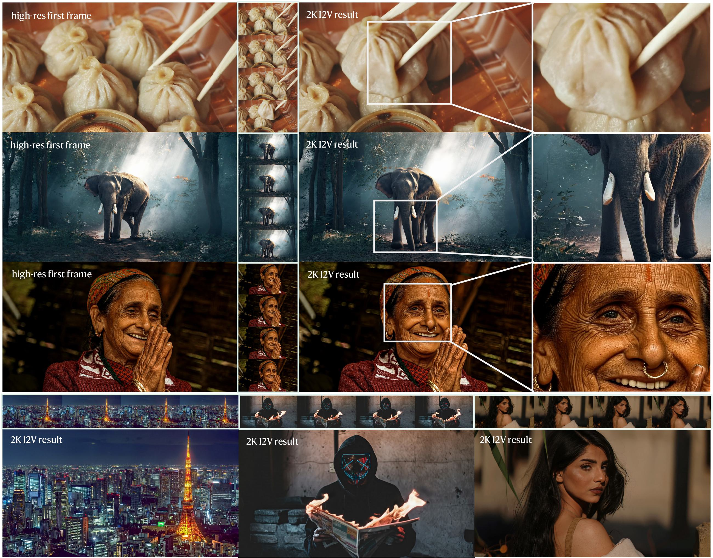
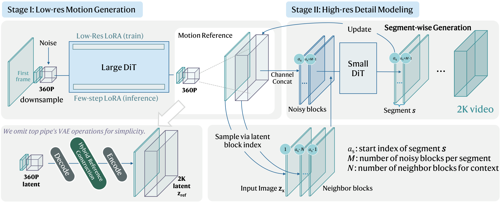
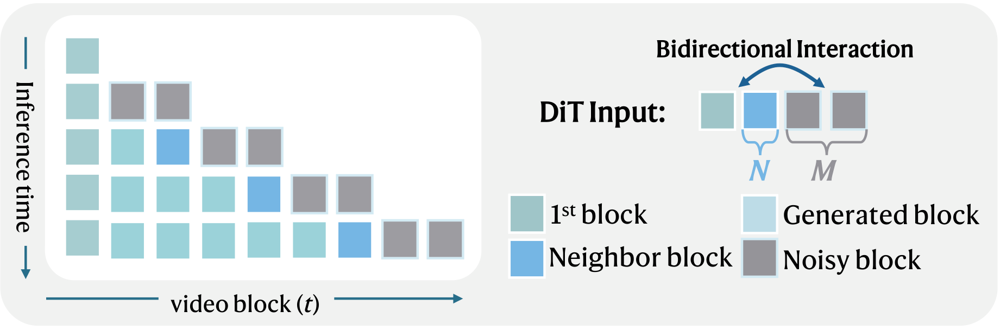

<div align="center">


<h1>Efficient High-Resolution Image-to-Video Generation<br/>via Conditional Segment-wise Generation</h1>

**[YaoYang Liu](https://github.com/LazySheeeeeep)<sup>1</sup> · Yuechen Zhang<sup>2</sup> · Wenbo Li<sup>3</sup> · Yufei Zhao<sup>4</sup> · Rui Liu<sup>5</sup> · Long Chen<sup>1,\*</sup>**

<sup>1</sup>HKUST &nbsp;·&nbsp; <sup>2</sup>CUHK &nbsp;·&nbsp; <sup>3</sup>Joy Future Academy &nbsp;·&nbsp; <sup>4</sup>HKU &nbsp;·&nbsp; <sup>5</sup>HUAWEI Research
<br/>
<sub>* Corresponding author</sub>

<p>

[](https://arxiv.org/abs/2605.06356)
[](https://hkust-longgroup.github.io/SwiftI2V/)

</p>



<em>2K (2560×1408) image-to-video generation — 81 frames in ~111s on a single H800, and runnable on a single RTX 4090 (24 GB).</em>

</div>

---

## 📢 News

- **[2026-05]** 📄 arXiv preprint released: [arXiv:2605.06356](https://arxiv.org/abs/2605.06356)
- **[2026-05]** 🌐 Project page online: [hkust-longgroup.github.io/SwiftI2V](https://hkust-longgroup.github.io/SwiftI2V/)
- Code and checkpoints will be released in this repository &mdash; stay tuned!

## ✨ Highlights

- 🚀 **202× less GPU-time** than end-to-end 2K I2V baselines
- 🖼️ **Native 2K** (2560×1408) generation at **81 frames**
- 💻 **Single consumer RTX 4090 (24 GB)** is enough — no data-center GPU required
- 🧩 **Conditional Segment-wise Generation (CSG)** with bidirectional contextual interaction — memory-bounded regardless of video length
- 🎯 **Stage-transition training** closes the train&ndash;test gap between Stage&nbsp;I and Stage&nbsp;II

## 📖 Overview

Image-to-video (I2V) generation has made rapid progress, yet scaling to **high resolution** (e.g., 2K) is bottlenecked by the efficiency&ndash;fidelity dilemma: end-to-end high-resolution generators deliver strong quality but require tens of thousands of GPU-seconds per clip, while low-resolution generation followed by video super-resolution (VSR) loses the input-image condition and hallucinates details inconsistent with the reference.

**SwiftI2V** is an efficient two-stage framework that resolves this dilemma:

- **Stage I** produces a low-resolution motion reference with a large backbone under few-step sampling.
- **Stage II** refines it to 2K, conditioned on both the *input image* and the Stage&nbsp;I output.
- **Conditional Segment-wise Generation (CSG)** divides the temporal axis into bounded segments augmented by neighboring contexts, keeping peak memory roughly constant regardless of total length.
- **Stage-transition training** simulates Stage&nbsp;I-style artifacts during Stage&nbsp;II training to close the train&ndash;test gap.

On VBench-I2V at 2K, SwiftI2V matches strong end-to-end baselines on key I2V metrics while reducing total GPU-time by **202×**.

## 🏗️ Method

<p align="center">
  
</p>
<p align="center"><em>Overall two-stage pipeline of SwiftI2V.</em></p>

<p align="center">
  
</p>
<p align="center"><em>Conditional Segment-wise Generation (CSG) with bidirectional contextual interaction.</em></p>

## 🎥 Demo

For the full gallery, qualitative comparisons, ablations, and RTX 4090 results, please visit our **[Project Page](https://hkust-longgroup.github.io/SwiftI2V/)**.

## 📋 TODO

- ✅️ Release project page
- ✅️ Release arXiv paper
- [ ] Release inference code
- [ ] Release Stage I / Stage II checkpoints

## 📝 Citation

If you find SwiftI2V useful in your research, please consider citing:

```bibtex
@misc{liu2026swifti2vefficienthighresolutionimagetovideo,
      title={SwiftI2V: Efficient High-Resolution Image-to-Video Generation via Conditional Segment-wise Generation},
      author={YaoYang Liu and Yuechen Zhang and Wenbo Li and Yufei Zhao and Rui Liu and Long Chen},
      year={2026},
      eprint={2605.06356},
      archivePrefix={arXiv},
      primaryClass={cs.CV},
      url={https://arxiv.org/abs/2605.06356}
}
```

## 🙏 Acknowledgements

We gratefully acknowledge the following open-source projects that made this work possible:

- [**Wan**](https://github.com/Wan-Video) &mdash; the video generation foundation model we build upon.
- [**DiffSynth-Studio**](https://github.com/modelscope/DiffSynth-Studio) &mdash; for its flexible diffusion training and inference framework.
- [**LightX2V**](https://github.com/ModelTC/LightX2V) &mdash; for its efficient inference utilities.

The project page design is adapted from the [Nerfies](https://nerfies.github.io/) academic template ([CC BY-SA 4.0](https://creativecommons.org/licenses/by-sa/4.0/)).
